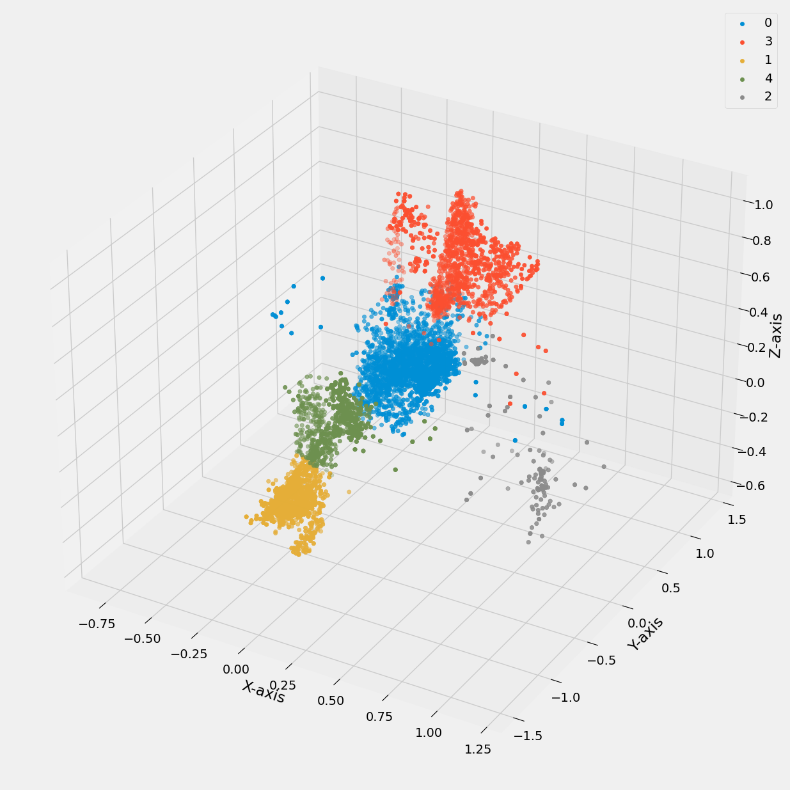
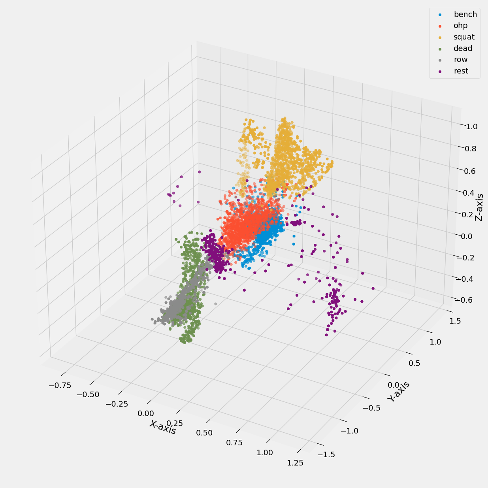

## Data Science Project Template

- Based on Dave Ebbelaar Research Project

Template for structuring your Python data science projects. It is based on [Cookie Cutter Data Science](https://drivendata.github.io/cookiecutter-data-science/).

## Notes

Better to export pickle if you are using df later so date time stuff is preserved

Filter subtle noise (not outliers) and identify parts of data that explain most of the variance

Add termporal, frequency, and cluster features

### Feature Engineering

- Can drop bad rows, or use imputation (mean, median, min, max between two values, or interpolate)
- Used Butterworth lowpass filter
  - Frequency is 1000/200 since 1000 ms is 1 second and 200ms was the rate we we resampled at
  - cutoff -> higher the number, more angles present, lower the number, smoother the curves
  - Used to remove high frequency noise from a dataset
  - Removes any data points above a certain threshold frequency, while still preserving the underlying pattern of the data
- PCA
  - Passing in first six columns into PCA method and then using the 'elbow' method to analyze
  - Elbow occurred at 3 labels
  - Captured 6 columns into three while capturing as much of the variance as possible
- Sum of squares (magnitude)
  - Direction is impartial to device orientation and can handle dynamic re-orientations
- Fourier Transformation
  - Measurements to be represented by sinusoid functions with different frequencies
  - Data can be represented as frequency components
  - Provides insights into patterns and trends that may otherwise not have been visible
  - DFT (Discrete Fourier Transformation) can help reduce noise allowing for more accurate models
- Temporal Abstraction
  - Using a rolling window walking over our data to compute, over a window size, the average and standard deviation
  - Will use mean and standard deviation
- Windows
  - For windows, we skipped every other column to avoid overfitting due to aggregated new values in our windows
- Clustering
  - KMeans can use elbow method as well
  - Cluster 0 combines bench press and overhead press
  - 
  - 

### Outlier Detection (IQR, Chauvenet, LOF)

- Better to grab exercises by label first, then apply outlier detection through boxplots, calculating IQR values, and plotting them via 'groupby'
- How to test for normal distribtuion -> boxplot has whiskers that are approx similar or histogram with bell shaped curve
- Chauvenet's Criterion -> Detects outliers, assumes normal distribtution
  - Rest data is the only one that does not look normally distributed
- IQR can sometimes be useful, sometimes Chauvenet's can be good if normal distribution is assumed
- Local Outlier Factor
  - Distance based
  - Unsupervized learning approach
  - Uses density of clusters with KNN to determine outliers
  - Can identify outliers within data itself using this approach

## Data

- Gyroscope data -> deg/s
  - more measurements per second
  - .08 seconds (1/12.5)
- Accelerometer data -> g force
  - .04 seconds (1/25)
- 5 participants did the following with a **light set** and a **heavy set** and a **rest set** with recordings being 5 repetitions
  - bench press
  - deadlift
  - overhead press
  - barbell row
  - squat
- Supervized learning project
  - Will consist of structured and unstructured data
  - Multi-class classification goal (6 in total)
- Files are mostly unstructured so they have to be stiched together as we incorprate them into Pandas df's
- Want
  - Timestamp
  - x, y, z accel
  - x, y, z gyro
  - label indicating exercise type (or rest)
- File naming convention (split on '-')
  - Participant
  - Label: type of activity ('overhead press would be ohp')
  - category (heavy, medium, standing, etc)
- Adding 'set' to each df so that we don't have to group by category, label, and participant later
- Epochs -> Unit Time
  - Time since Jan 1, 1970
  -
